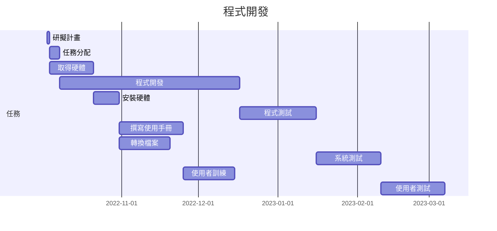
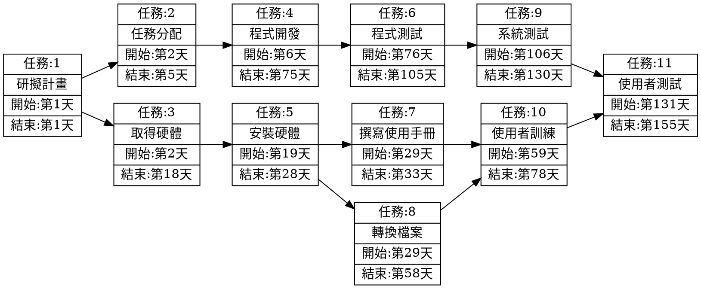

## 甘特圖

```mermaid
gantt
    title 程式開發
    
    section 任務
    研擬計畫:a1, 2022-10-03,1d
    任務分配:a2, after a1,4d
    取得硬體:a3, after a1,17d
    程式開發:a4, after a2,70d
    安裝硬體:a5, after a3,10d
    程式測試:a6, after a4,30d
    撰寫使用手冊:a7, after a5,25d
    轉換檔案:a8, after a5,20d
    系統測試:a9, after a6,25d
    使用者訓練:a10, after a7 a8,20d
    使用者測試:a11, after a9 a10,25d
```

## PERT/CPM 圖:

```graphviz
digraph {
	node[shape=record];
	rankdir="LR";
    no1 [label = "任務:1 | 研擬計畫 | 開始:第1天 | 結束:第1天 "]
    
    no2 [label = "任務:2 | 任務分配 | 開始:第2天 | 結束:第5天"]
    no1->no2
    
    no3 [label = "任務:3 | 取得硬體 | 開始:第2天 | 結束:第18天"]
    no1->no3
    
    no4 [label = "任務:4 | 程式開發 | 開始:第6天 | 結束:第75天 "]
    no2->no4
    
    no5 [label = "任務:5 | 安裝硬體 | 開始:第19天 | 結束:第28天 "]
    no3->no5
    
    no6 [label = "任務:6 | 程式測試 | 開始:第76天 | 結束:第105天 "]
    no4->no6
    
    no7 [label = "任務:7 | 撰寫使用手冊 | 開始:第29天 | 結束:第33天 "]
    no5->no7
    
    no8 [label = "任務:8 | 轉換檔案 | 開始:第29天 | 結束:第58天 "]
    no5->no8
    
    no9 [label = "任務:9 | 系統測試 | 開始:第106天 | 結束:第130天 "]
    no6->no9
    
    no10 [label = "任務:10 | 使用者訓練 | 開始:第59天 | 結束:第78天 "]
    {rank=same;no7 no8}
    no7->no10
    no8->no10
    
    no11 [label = "任務:11 | 使用者測試 | 開始:第131天 | 結束:第155天 "]
    {rank=same;no9 no10}
    no9->no11
    no10->no11
}
```

## 關鍵路徑:
1 -> 2 -> 4 -> 6 -> 9 -> 11

